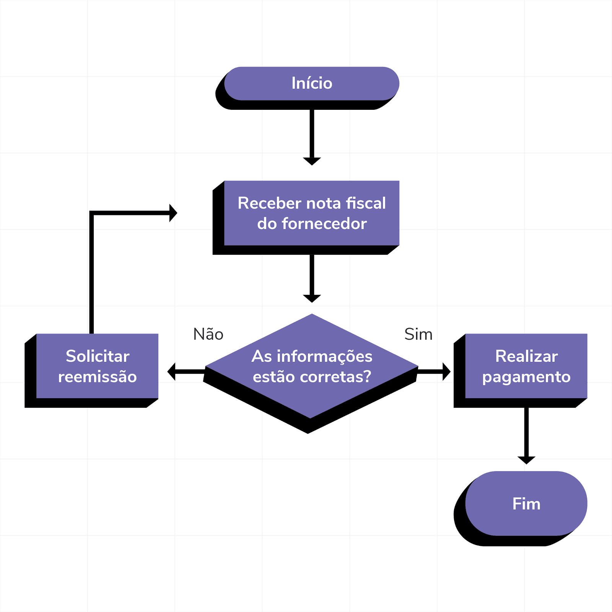

# Algoritmos

Narrativa para criar um algoritmo de soma:

- Pedir o N1 **E.D**
- Pedir o N2 **E.D**
- Calcular a soma **P.D**
- Exibir resultado **S.D**

## Comandos no algoritmo

- Entrada de dados (Usuário Interagindo com o sistema)
- Processamento de dados (Sistema processando a entrada do usuário)
- Saída de dados (Sistema interagindo com o usuário)

## Fluxograma

Um fluxograma é a representação figurativa de um algoritmo

## Operadores aritméticos

[+] - soma
[-] - subtração
[*] - multiplicação
[/] - divisão
[div] - Divisão inteira
[mod/%] - Resto da divisão
[()] prioridade

### ordem de precedência

[*] e divisão (/, div e mod)